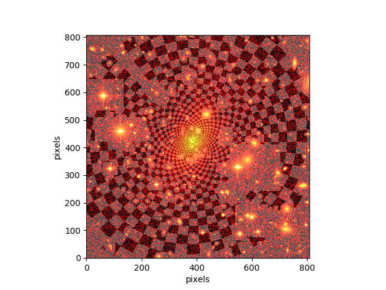
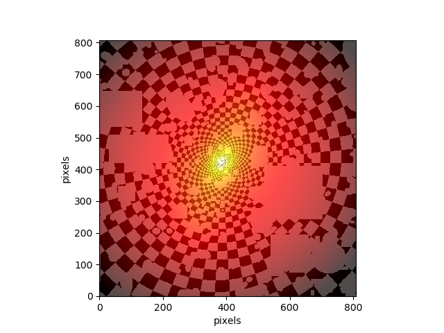
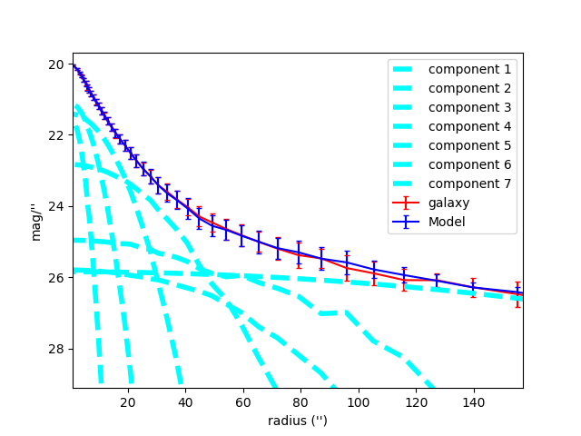
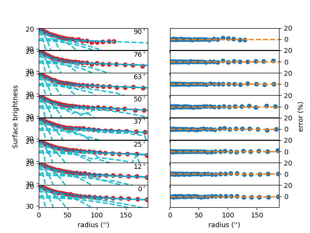

# GALFITools

GALFITools is a collection of Python
scripts that I have used to improve the
output analysis of GALFIT.

## Installation

Copy or clone this code. These codes are
written for python 3.

The python libraries used for those scripts are:
- numpy
- sys
- os
- subprocess
- astropy
- scipy
- matplotlib
- mgefit

The main programs are:
- BorderMask.py
- [EllipSectGalfit.py](./Ellipse.md)
- MaskBox.py
- GetK.pl
- GalfitSky.py
- xy2fits.py


## BorderMask.py

Program that creates a mask that fills the
edges of an HST image.

To run the code just type in the command line:
```
 ./BorderMask.py [ImageFile] [MaskBorderImage] [--val Value] [--le0]
```

Where ImageFile is the original image. MaskBorderImage is the
output mask image. Value is the number that will have the
pixel flux in the border mask. le0 will mask all the pixels below or
equal to zero.

## EllipSectGalfit.py


This is a "quick" (and dirty) substitute for IRAF's ellipse
routine. It creates a "ellipse" profile of galaxy
and GALFIT's model output (peng et al 2002). It also create a
multiple plots for different angles.  






To run the code just type in the command line (or in ipython):

```
 ./EllipSectGalfit.py [GALFITOutputFile] [--logx] [--q AxisRatio] [--pa PositionAngle] [--sub] [--pix] [--ranx Value]
 ```

GALFITOutputFile: GALFIT output file  (e.g. galfit.01)
logx: plots X-axis as logarithm

q: introduce axis ratio  where the user introduces the axial symmetric generalized
ellipse where EllipSectGalfit computes the profile. If ignored,
it takes the one of the last component that comes in GALFITOutputFile.

pa: introduce position angle (same as GALFIT).  If ignored,
this code takes the one of the last component that comes in GALFITOutputFile.

sub: plots subcomponents.

pix: plot the x-axis in pixels

ranx: constant that multiplies the range of the x axis

rany: constant that multiplies the range of the y axis

noplot: do not display images

Example:
 EllipSectGalfit.py galfit.01 --logx

or Example:
 EllipSectGalfit.py galfit.02 --q 0.35 --pa 60 --sub


Note: Errors given by EllipSectGalfit will be greater
than those coming from IRAF's ellipse since this program leaves fixed
the axis ratio for the whole galaxy while IRAF's ellipse
can change axis ratio for each isophote.

Note 2: EllipSectGalfit already uses your mask (option "F)" GALFIT) if this
is a FITS image.  


#### Warning
Be sure to run this code in the same path that you run GALFIT.


## Maskbox.py

Maskbox.py put (or remove) mask patch on
an already existing mask FITS file. It does this
using a box file region. This file is
created by DS9 program. You can create as many
box regions as you like in a single file. Maskbox will fill
those box regions with the number specified in Value.   

To run the code just type in the command line (or in ipython):

```
./MaskBox.py [ImageFile] [RegFile] [Value]
```
Where ImageFile is the mask image to edit. RegFile
is the DS9 Region file which contains the box region
to patch, and, Value is the flux number you want to
establish for the pixels within the box region.


## GalfitSky.py

GalfitSky.py computes the sky using GALFIT

Maskbox.py put (or remove) mask patch on
an already existing mask FITS file. It does this
using a box file region. This file is
created by DS9 program. You can create as many
box regions as you like in a single file. Maskbox will fill
those box regions with the number specified in Value.   

To run the code just type in the command line (or in ipython):

```
./GalfitSky.py [ImageFile] [Magzpt] [scale] [--X x] [--Y y]
```
Where ImageFile is the galaxy image. Magzpt is the
zero point of the image. Scale is the factor which is
increased the ellipse mask of the galaxy. X and Y are
the pixel coordinates of the galaxy to compute its sky.  


## GetK.pl

Perl script that gives the K constant for a
determined Sersic index. The one that allows the surface
brightness (Ie) to be at the half of the light radius (Re).
See Sersic equation.

To run the code just type in the command line:
```
 ./usage: ./GetK.pl [SersicIndex]
```
Where SersicIndex is (obviously) the Sersic index.


## xy2fits.py

Program that creates a fits mask from a ascii mask.

To run the code just type in the command line:

```
Usage: ./xy2fits.py [ImageFile] [AsciiMask] [--val Value]
```

Where ImageFile is the original image. AsciiMask is the
GALFIT Ascii Mask that only contains the positions (X,Y)
of the bad pixels. Value is the flux that contains the
mask pixels (Default = 1).


#### Questions?
Do you have questions or suggestions?
Please send an email to canorve [at] gmail [dot] com

## License
These codes are under the license of **GNU**

ElipSectGalfit.py uses the mgefit library which is
described in Cappellari, MNRAS, 333, 400 (2002).
