# EllipSectGalfit.py

This is a "quick" (and dirty) substitute for IRAF's ellipse
routine. It creates a "ellipse" profile of galaxy
and GALFIT's model output (peng et al 2002). It also create a
multiple plots for different angles.  

The options to run the code in the terminal (or ipython) are:

```
 ./EllipSectGalfit.py [GALFITOutputFile] [--logx] [--q AxisRatio] [--pa PositionAngle] [--sub] [--pix] [--ranx Value] [--ranx/y Value] [--grid] [--dpi Value] [--noplot] [--out OutFile]
 ```

Examples: 

 EllipSectGalfit.py galfit.01 --logx

or 

 EllipSectGalfit.py galfit.02 --q 0.35 --pa 60 --sub


### Options 

GALFITOutputFile: GALFIT output file  (e.g. galfit.01)

logx: plots X-axis as logarithm

q: axis ratio value. If ignored, it takes the one from the last component in GALFITOutputFile.

pa: position angle value (same as GALFIT).  If ignored, it takes the one 
from the last component in GALFITOutputFile.

sub: plot include the model subcomponents

pix: plot the top of x-axis in pixels

ranx: constant that multiplies the range of the x axis to increase/decrease or 
it can be used as xmin-xmax to change range

rany: constant that multiplies the range of the y axis to increase/decrease range
or it can be used as ymin-ymax to change range.

noplot: the code creates images but do not display them.

grid: display a grid in the plot

dpi: dots per inch value to increase/decrease resolution.

out: creates output file from the data of the plot (Rad (arcsec) SurfaceBrightness  ErrSurface). 


### Notes

* EllipSectGalfit already uses mask image (option "F" GALFIT) if this
    is a FITS image. If your mask is an ASCII file you can convert it to FITS
    using the xy2fits [xy2fits.py](./xy2fits.md) tool.


* EllipSectGalfit uses axis ratio (q) and position angle (pa) to create a grid 
    using the function sectors_photometry from the mgefit library. Unlike IRAF's Ellipse, 
    q and pa are fixed through radius. See the two images below: 

    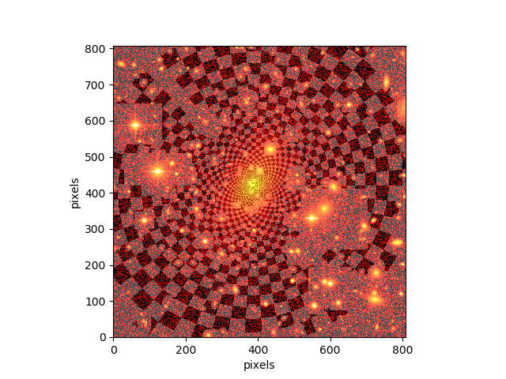
    

    For this reason, errors given by this program are expected to 
    be greater than those coming from IRAF's ellipse since EllipSectGalfit 
    leaves the axis ratio fixed for the whole radio. On the other hand, IRAF's ellipse
    can change axis ratio and angular position for each isophote.

* Be sure to run this code in the same path that you run GALFIT. In addition,
    since EllipSectGalfit reads the "B)" option of galfit.XX file, it 
    must be the last fit of GALFIT. 

### Examples

To check how the plots change with the output options see 
the examples below for a Elliptical galaxy that was fitted 
with 7 gaussians (Galaxy and model images are the ones 
displayed above). 

Example 1: 
./EllipSectGalfit.py galfit.46 

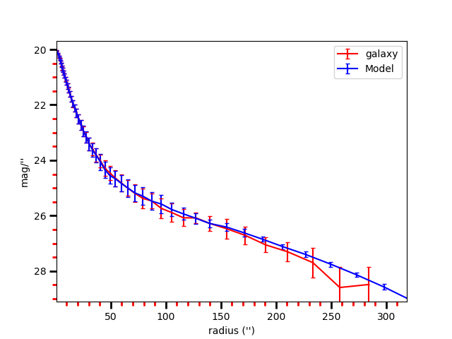
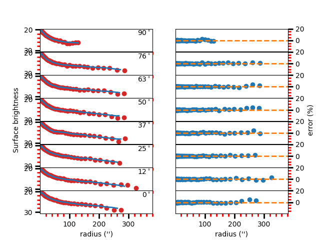

Example 2:
./EllipSectGalfit.py galfit.46 --logx
(log x-axis)

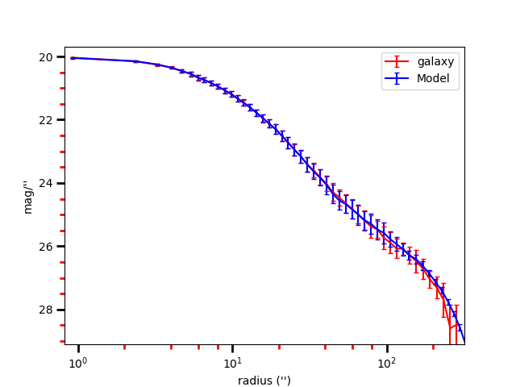
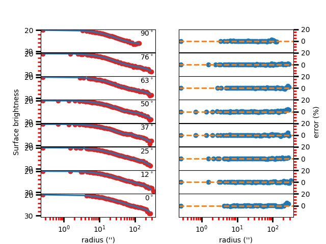

Example 3: 
./EllipSectGalfit.py galfit.46 --sub
(displays the 7 gaussians)

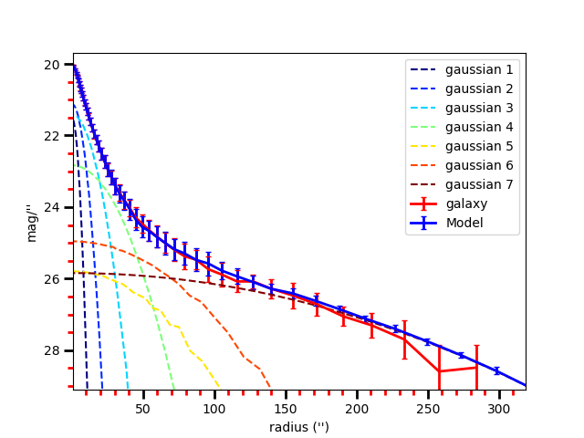
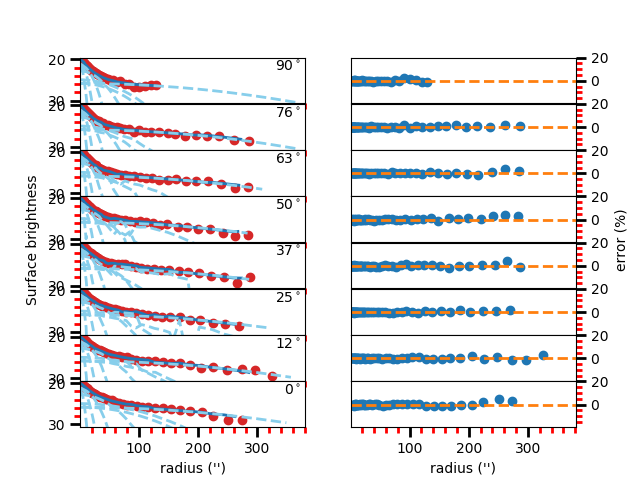

Example 4: 
./EllipSectGalfit.py galfit.46 --pix
(put pixels marks on top x-axis)

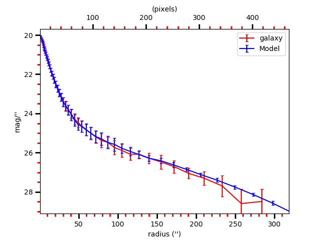
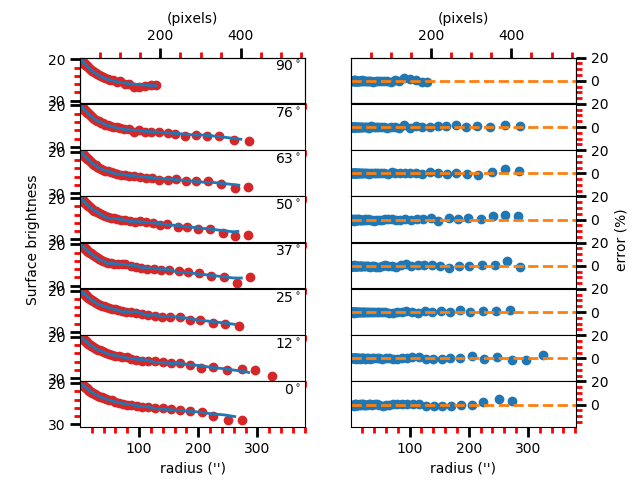

Example 5: 
./EllipSectGalfit.py galfit.46 --ranx 0.5 
(range in x-axis is decreased 50%)

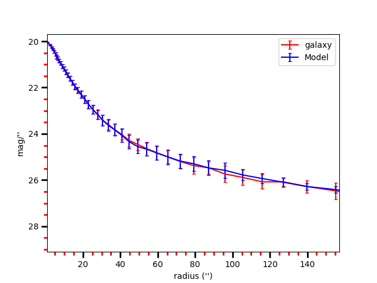
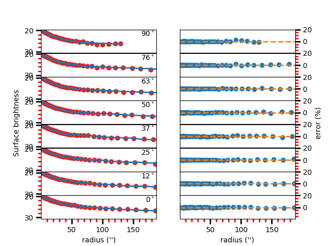

Example 6: 
./EllipSectGalfit.py galfit.46 --rany 2 
(range in y-axis doubled)

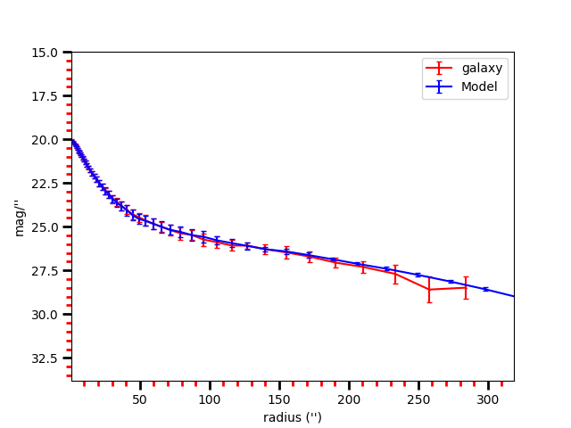
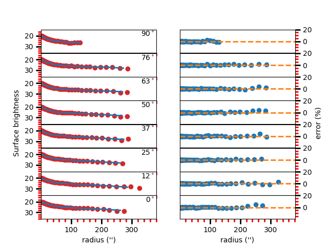

Example 7: 
./EllipSectGalfit.py galfit.46 --ranx 1-50 
(x-axis ranges from 1 to 50)

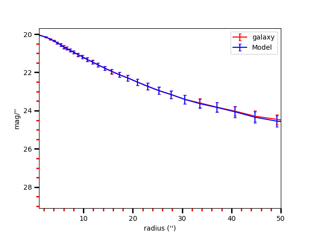
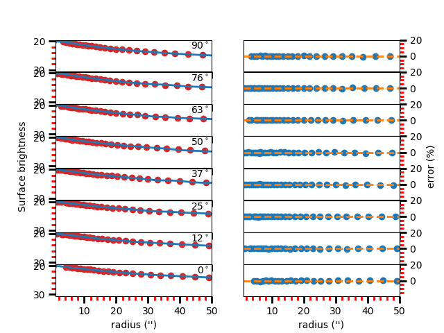

Example 8: 
./EllipSectGalfit.py galfit.46 --grid 


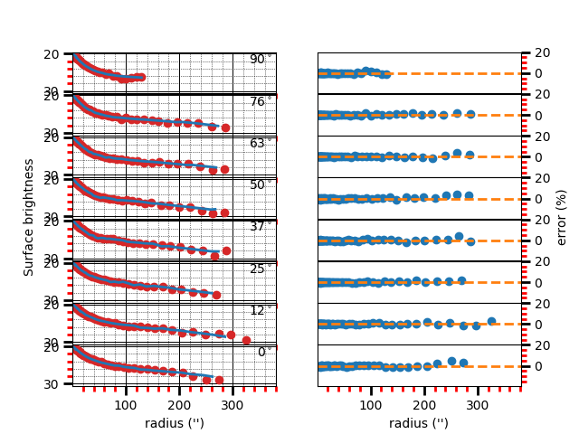

EllipSectGalfit.py uses the mgefit library which is
described in Cappellari, MNRAS, 333, 400 (2002).
