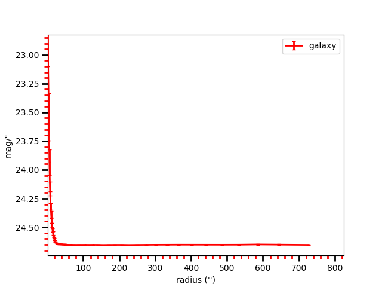
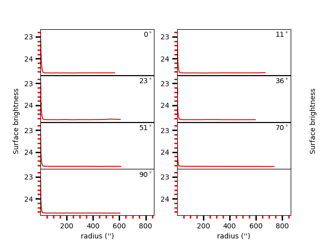

# sbprof.py

sbprof.py creates surface brightness profiles
from fits images. It also creates multiple surface 
brightness plots for separate angles.  

**Code: [sbprof.py](../sbprof.py)**

If sky parameter is not given, *sbprof.py* can compute it 
using two methods: 1) averaging over an annuli around the galaxy 
at a radius when gradient turns positive, and 2) averaging 
over the whole image remooving the top 80% and bottom 20% of the pixels.

## Additional Libraries: mgefit

**Install the mgefit library via pip:**  

```
pip install mgefit
```

*quick example of how to run the program:*

```
 ./sbprof.py image.fits X Y -mask mask.fits -q 0.8 -pa 40
```

## OPTIONS

The options to run the code in the terminal (or ipython) are:

```
 ./sbprof.py [GALFITOutputFile] [-logx] [-q AxisRatio] [-pa PositionAngle] [-pix] [-ranx/y Value] [-grid] [-dpi Value] [-noplot] [-sbout] [-minlevel Value] [-sectors Value] [-help] 
 ```

### Input File

**IMAGE**: FITS image.

**X** **Y**: X,Y pixel position of the galaxy on the image.

**help**: Help menu

**logx**: plots X-axis as logarithm

**q**: axis ratio value. If ignored, it takes the one from the last component in GALFITOutputFile.

**pa**: position angle value (same as GALFIT). If ignored, it takes the one 
from the last component in GALFITOutputFile.

**pix**: adds pixels units to the top of x-axis.

**ranx**: constant that increase/decrease the range of the x axis *or* 
it can be used as xmin-xmax to change range.

**rany**: constant that increase/decrease the range of the y axis *or* 
it can be used as ymin-ymax to change range.

**noplot**: the code creates images but do not display them.

**grid**: display a grid in the plot

**dpi**: dots per inch value to increase/decrease resolution.

**sbout**: Creates output file containing the surface brightness profiles.

**sky**: sky level to be subtracted from fits image.

**mask**: image fits mask. It must has the same size as input image

### Advanced 

**minlevel**: Parameter given directly to sectors_photometry.
              Ellipse radius stops when it founds this value. Check sectors_photometry manual 

**sectors**: parameter given directly to sectors_photometry. Divide ellipse in 'sectors'
                      Check sectors_photometry manual
                     

## Some Notes to take into account


* EllipSectGalfit uses axis ratio (*q*) and position angle (*pa*) to create an      "ellipse" *grid* using the function *sectors_photometry* from the *mgefit* library. Unlike IRAF's Ellipse, *q* and *pa* are fixed through radius. 

    For this reason, errors are expected to 
    be greater than those coming from IRAF's ellipse since EllipSectGalfit 
    averages errors for different isophotes. While, on the other hand, IRAF's ellipse
    can change axis ratio and angular position for each isophote. 
    
    This is how mgefit *sectors_photometry* returns the counts data and, unless I write my own code, I can't change that. 

* The angles shown in the multi-plot are measured from the galaxy's major axis.
    They are **not** measured from the Y-axis. 


### Plot Examples

See the output  examples below for an elliptical galaxy: 

* Simple plot example: 
    ./EllipSectGalfit.py galfit.46 

    
    


**sbprof.py** uses the mgefit library which is
described in Cappellari, MNRAS, 333, 400 (2002).

Check my others GALFIT tools [here](../README.md)
 

